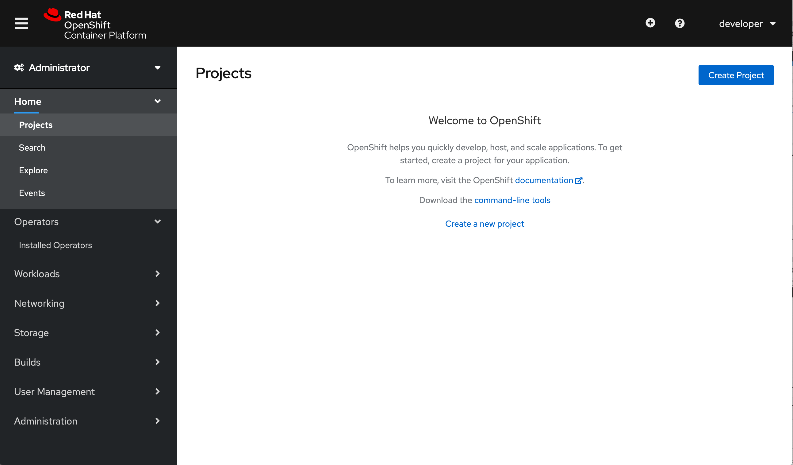
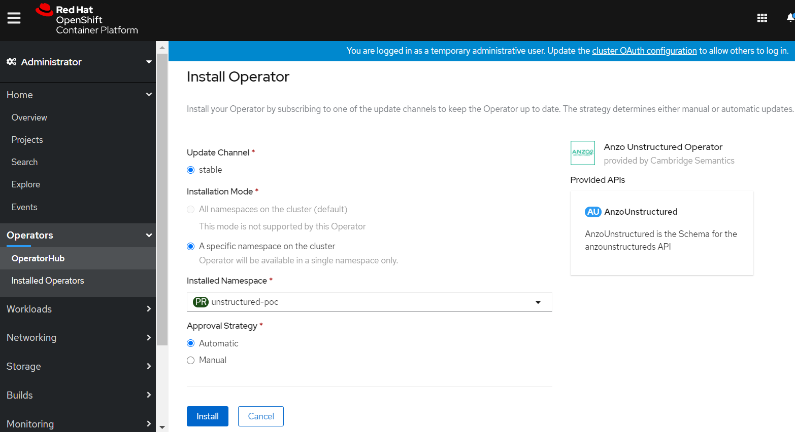
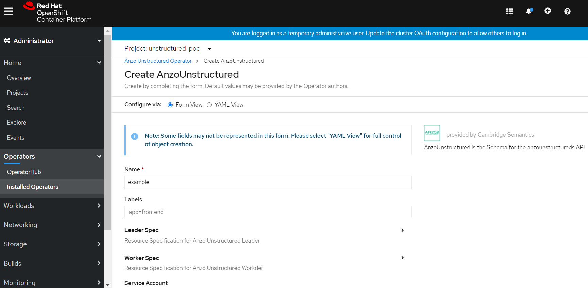

# unstructured-operator

## By Cambridge Semantics Inc.

## Prerequisites

* Red Hat Openshift Container Platform on Kubernetes, version >= 4.3
* Kubectl, versions {1.20-1.16}
* Anzo Unstructured Operator Subscription

## Optional Prerequisites
### Create Project(Namespace) if required



## Steps to deploy Anzo Unstructured Operator

#### Login to OpenShift Console:

#### Operators --> OperatorHub --> Search Unstructured Operator --> Install


#### Select Namespace where you want to deploy the operator and click on Install


#### And check that operator installation is successful

#### Operators --> Installed Operators --> Unstructured Operator --> Create Instance


#### Use either Form View or YAML View to set required properties, use **Anzo Unstructured CustomResource(CR) Specification** for definitions



## Anzo Unstructured CustomResource(CR) Specification

| Parameter | Description | Default |
|-----------|-------------|---------|
| `metadata.name` | Name of CR | au01 |
| `metadata.namespace` | Namespace of CR | |
| `metadata.labels` | Dictionary of (key: val) as labels of CR | |
| `spec.volumes` | List of persistent volumes for AnzoUnstructured | commented, please uncomment to add value |
| `spec.volumes.[i].name` | Name for persistent volume | |
| `spec.volumes.[i].mountPath` | Path where persistent volume should be mounted inside container | |
| `spec.volumes.[i].pv` | Attributes to configure persistent volume, of type v1.PersistentVolume | |
| `spec.volumes.[i].pvc` | Attributes to configure persistent volume claim, of type v1.PersistentVolumeClaim | |
| `spec.msLeader.nodeConfig.spec` | Configuration specification for AnzoUnstructured Leader pods | |
| `spec.msLeader.nodeConfig.spec.replicas` | Number of pods for AnzoUnstructured Leader | 1 |
| `spec.msLeader.nodeConfig.spec.serviceName` | Name of headless service for AnzoUnstructured | au-<metadata.name>-ms |
| `spec.msLeader.nodeConfig.spec.template.spec.serviceAccountName` | Service account name for pods | unstructured-operator |
| `spec.msLeader.nodeConfig.spec.template.spec.containers.x.Name` | Name of AnzoUnstructured Leader container | ms |
| `spec.msLeader.jvmMemory` | AnzoUnstructured leader JVM memory | |
| `spec.msLeader.bootProperties` | AnzoUnstructured leader specific boot properties | |
| `spec.auWorker.nodeConfig.spec` | Configuration specification for AnzoUnstructured Worker pods | |
| `spec.auWorker.nodeConfig.spec.replicas` | Number of pods for AnzoUnstructured Worker | 1 |
| `spec.auWorker.nodeConfig.spec.serviceName` | Name of headless service for AnzoUnstructured | au-<metadata.name>-w |
| `spec.auWorker.nodeConfig.spec.template.spec.serviceAccountName` | Service account name for pods | unstructured-operator |
| `spec.auWorker.nodeConfig.spec.template.spec.containers.x.Name` | Name of AnzoUnstructured Worker container | w |
| `spec.auWorker.bootProperties` | AnzoUnstructured worker specific boot properties | |
| `spec.auWorker.jvmMemory` | AnzoUnstructured worker JVM memory | |
| `spec.bootProperties` | Boot properties i.e. the environment variables for AnzoUnstructured CR | commented, please uncomment to add value |

## References

```https://docs.cambridgesemantics.com/```
